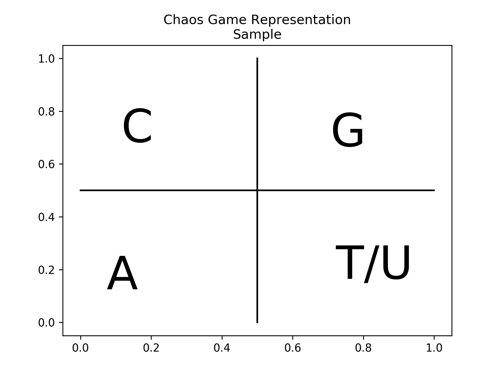
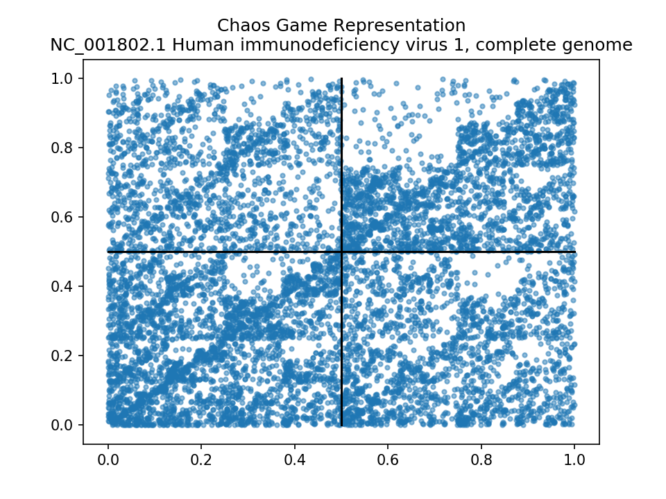

# Chaos Game Representation

`chaotic dynamical systems` (Jeffery 1990), or simply `chaos` was a physics terminology. The common idea of `chaos` is lack of order, randomness. Yet, with proper application of maths, chaos can be given form and as such, quantified.

Thus, here comes `chaos game`, first described by [Fractal modeling of real world images, Barnsly, 1988](https://doi.org/10.1007/978-1-4612-3784-6_5) and presented as a novel method, `Chaos Game Representation`, to present DNA structure, [Chaos game representation of gene structure, H.Joel Jeffrey, 1990](https://www.ncbi.nlm.nih.gov/pmc/articles/PMC330698/?tool=pmcentrez&report=abstract)


This is a pythonic implementation (alpha stage) of cgr using biopython and matplotlib, to generate a cgr image of DNA fasta file.

Ability to compare two different cgr will eventually be added.

Ability to create cgr of anything other then DNA (e.g protein), is not planned for now.

# Table of contents
1. [Mathematical Description](#math)
2. [Algorithm/Pseudocode](#algorithm)
3. [Usage](#usage)
4. [Sample CGR](#sample)
5. [TODO](#todo)
6. [References](#ref)

## Derivation of a 4 nucleotide CGR <a name="math"></a>

CGR is an `Iterated Function System (IFS)`, a derivative of fractals.

Mapping nucleotides in a two dimensional system will have the IFS constitute a pair of linear equation `x = ax + by + e` and `y = cx + dy + f`, providing the (x,y) coordinate of said nucleotide.

Each nucleotide `n` is assigned an original start coordinate (think of it as a corner in a graph) - with 4 nucleotide, `A, T, G, C` are assigned, `(0,0), (1,0), (1,1), (0, 1)` respectively.

With 4 individual loci, we have 8 equations, which can be summarized as: `w(x, y) = (ax + by + e, cx + dy + f)` and a probability, `p` for each loci. If the DNA sequence were completely random, an example IFS code might look like:

```
w	a	 	  b		c		d		  e		  f		  p
1	0.5		0		0		0.5		0		  0		  0.25
2	0.5		0		0		0.5		0		  0.5		0.25
3	0.5		0		0		0.5		0.5		0		  0.25
4	0.5		0		0		0.5		0.5		0.5		0.25
```

TODO: Corresponding CGR
TODO: Tweak the p to 0.1, 0.2, 0.3 and 0.5, the new CGR

## Description of CGR algorithm <a name="algorithm"></a>

For a DNA sequence with 4 nucleotide, A - T/U - G - C, we start with a graph



The center of the graph is (0.5, 0.5)

Algorithm to generate CGR:

```
	LET SEQUENCE seq OF LEN s,

	BEGIN
		start_nt = seq[0]
		center = (0.5, 0.5)
		if start_nt == A: nt_pos = (0,0)
		else if start_nt == T/U: nt_pos (1,0)
		else if start_nt == G: nt_pos (1,1)
		else if start_nt == C: nt_pos = (0,1)
		else: Break

		cgr_mark  =
      (
        (nt_pos[0] + center[0])/2,
        (nt_pos[1] + center[0])/2
        )

		plot(cgr_mark)

	NEXT
		while s:
			if start_nt == A: nt_pos = (0,0)
			else if start_nt == T/U: nt_pos (1,0)
			else if start_nt == G: nt_pos (1,1)
			else if start_nt == C: nt_pos = (0,1)
			else: Break

			cgr_mark = (
                    (nt_pos[0] + cgr_mark[0])/2,
                    (nt_pos[1] + cgr_mark[1])/2
                  )
                  plot(cgr_mark)
```

A plot is derived in linear time (baring the calculation of mid point)


## Usage <a name="usage"></a>

For now, simply do python3 pycgr/dnacgr.py.

anaconda3 or appropriate virtual env is recommended.

Eventually, the setup.py will incorporate a proper installation system.


```
Requires: python3; biopython; matplotlib

usage: dnacgr.py [-h] [--dest-dir SAVE_DIR] [--show] [--save] [--dpi DPI]
                 [files [files ...]]

Chaos Game Representation

positional arguments:
  files

optional arguments:
  -h, --help            show this help message and exit
  --dest-dir SAVE_DIR, -d SAVE_DIR
                        Where do you want to save the resulting CGRs?
  --show, -p            Do you want to display resulting CGRs?
  --save, -s            Do you want to save resulting CGRs?
  --dpi DPI, -i DPI     Where do you want to save the resulting CGRs?

````


## Sample CGR Images <a name="sample"></a>


## TODO <a name="todo"></a>

* Facility to compare two different CGRs
* Ability to create amino acid CGR
* Create PDF of CGR
* Save cgr to text file
* Use different color for different nucleotide

# References <a name="ref"></a>

[Jeffrey, H.J., 1990. Chaos game representation of gene structure. Nucleic Acids Res 18, 2163–2170.](https://www.ncbi.nlm.nih.gov/pmc/articles/PMC330698/)

[Barnsley, M.F., 1988. Fractal modeling of real world images, in: Barnsley, M.F., Devaney, R.L., Mandelbrot, B.B., Peitgen, H.-O., Saupe, D., Voss, R.F., Peitgen, H.-O., Saupe, D. (Eds.), The Science of Fractal Images. Springer New York, New York, NY, pp. 219–242.](https://doi.org/10.1007/978-1-4612-3784-6_5)

[Jie, G., Zhen-Yuan, X., 2009. Chaos game representation (CGR)-walk model for DNA sequences. Chinese Phys. B 18, 370.](https://doi.org/10.1088/1674-1056/18/1/060)
